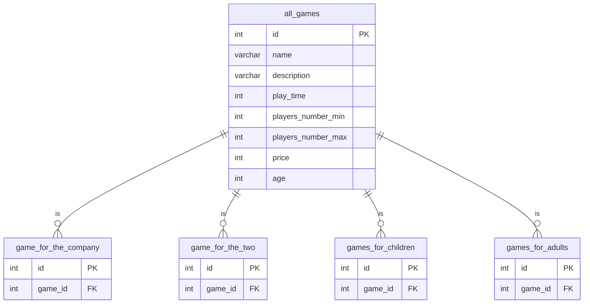

```mermaid
    erDiagram

    all_games ||--o{ game_for_the_company : is

    all_games ||--o{ game_for_the_two : is

    all_games ||--o{ games_for_children : is

    all_games ||--o{ games_for_adults : is

    all_games  {
        int id PK
        varchar name
        varchar description
        int play_time
        int players_number_min
        int players_number_max
        int price
        int age
    }

    game_for_the_company {
            int id PK
            int game_id FK
    }
        
    game_for_the_two {
        int id PK
        int game_id FK
    }

    games_for_children {
        int id PK
        int game_id FK
    }

    games_for_adults {
        int id PK   
        int game_id FK
    }


``` 

